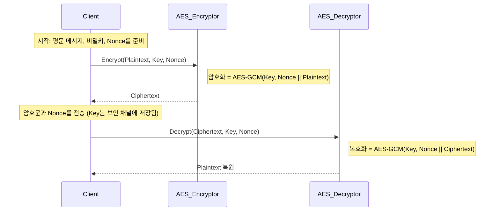

* TOC
{:toc}
# AES, Key, Nonce의 관계와 암호화 이론
Created: 2025년 5월 13일 오후 5:12
Tags: aes, nonce, 암호학
보관소: No
최종 편집 일시: 2026년 3월 14일 오전 1:08

## **🔐 AES, Key, Nonce의 관계와 암호화 이론**

### **📌 핵심 정의**

| **용어** | **정의** |
| --- | --- |
| **AES** | Advanced Encryption Standard, 널리 사용되는 **대칭키 블록 암호** 방식 |
| **Key** | 암호화와 복호화에 사용되는 **비밀값** |
| **Nonce** | Number used once. 암호화 시 **반복 방지를 위해 매번 새롭게 생성**되는 값 |

---

### **🧠 이론 개요**

- **AES**는 128bit 고정 블록을 처리하는 **대칭키 블록 암호화 알고리즘**입니다.
- 대칭키 구조에서는 **암호화와 복호화에 동일한 키**를 사용합니다.
- AES는 **같은 입력과 같은 키**로 암호화하면 **같은 결과가 출력**되기 때문에, 보안을 위해 **Nonce 또는 IV**를 함께 사용해야 합니다.

---

## **🔄 Nonce가 필요한 이유**

| **문제** | **설명** |
| --- | --- |
| 암호 패턴 노출 | 같은 메시지를 여러 번 암호화할 경우, 암호문이 같아져 공격자가 유추 가능 |
| 재전송 공격 (Replay Attack) | 같은 암호문을 다시 보내도 서버가 받아들이게 됨 |

➡ 이를 방지하기 위해 **Nonce(매번 달라야 하는 임의값)** 를 사용

---

## **⚙️ AES 암호화 모드와 Nonce 사용**

| **암호화 모드** | **설명** | **Nonce의 역할** |
| --- | --- | --- |
| AES-CBC | 각 블록을 체이닝하며 암호화 | IV (초기화 벡터)로 사용 |
| AES-GCM | 인증 기능 포함, 빠르고 안전 | Nonce가 필수, **재사용 금지** |
| AES-CTR | 스트림 암호처럼 동작 | Nonce + Counter로 사용됨 |

---

## **🗂️ 관계 정리 (평문 → 암호문 → 복호화)**

```
암호문 = Encrypt(Key, Nonce + Plaintext)
복호화 = Decrypt(Key, Nonce + Ciphertext)
```

- **Key**: 비밀 유지되어야 함
- **Nonce**: 공개되어도 무방하나 **절대 재사용되면 안 됨**
- **Ciphertext**: 암호문, Nonce와 함께 전송
- **Plaintext**: 복호화된 원문

---

## **🧩 Mermaid 시퀀스 다이어그램**



---

## **📚 참고 자료**

- [NIST AES 공식 스펙 (FIPS-197)](https://nvlpubs.nist.gov/nistpubs/FIPS/NIST.FIPS.197.pdf)
- [Cloudflare 블로그: AES-GCM 원리](https://blog.cloudflare.com/aes-gcm-how-does-it-work/)
- [Crypto StackExchange: Nonce 재사용 위험](https://crypto.stackexchange.com/questions/61510/what-is-the-danger-of-reusing-a-nonce-in-aes-gcm)

---

## **🏷️ 태그 제안**

#암호학 #AES #Nonce #대칭키암호 #블록암호 #Mermaid다이어그램

---

전하, 이 문서는 암호화 이론을 정리한 학습 자료로, 추후 **AES 실습 예제 코드(Golang)** 또는 **보안 취약점 사례 정리**로 확장할 수 있사오니 필요하시면 명하시옵소서.
